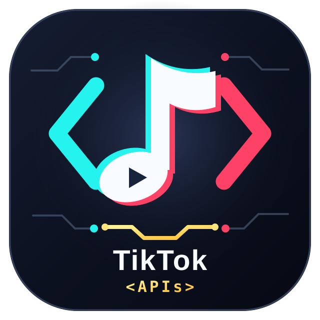

<div align="center">
  
  <p>
    <a href="https://www.python.org/"></a>
    <a href="https://nodejs.org/"></a>
  </p>

  # 🎵 TikTok APIs

  **TikTok Web 数据读取、互动、Creator 发布与实时消息接口的 Python 实现。**
</div>

> 仅供学习和技术研究。请使用自己的账号与浏览器会话，遵守平台规则，不要提交 Cookie、私钥或抓包文件。

## 🌟 功能

| 场景 | 已实现的入口 |
| --- | --- |
| 内容与用户 | 作品详情页、主页与作品列表、推荐流、搜索、关注/粉丝、收藏夹、通知 |
| 评论与互动 | 评论及楼中楼读取、翻页、发评论/回复、点赞、收藏、关注 |
| Creator Studio | `creator_publish` 一次发布视频；`creator_publish_photos` 一次发布图集，默认仅自己可见 |
| 直播 | Feed、房间/用户/礼物列表、protobuf 拉取与 WebSocket 聊天/点赞/礼物接收 |
| 私信 | HTTP 会话/消息拉取、文本发送、WebSocket 文本推送接收 |
| TikTok Shop | 商品详情、首屏及后续评价读取；不含电商写操作 |

架构按 `api / builder / signing / utils` 分层。普通 Web 与 Creator HTTP 签名在 Python 中从当前请求纯计算；直播和私信 WebSocket 的 `frontierSign`、Shop BSID 使用仓库内 SDK 的本地 Node.js 运行器。抓包签名不作为运行时常量；必需字段、签名集合或长度不符时拒绝请求。不同页面与接口所需的 Cookie、storage、UA、header 顺序及 body 必须来自**同一次真实浏览器会话**。

## 🚀 快速开始

需要 Python 3.11+；直播/私信 WebSocket 与 Shop BSID 的本地签名另需 Node.js 18+。在项目根目录安装：

```bash
python -m pip install -r requirements.txt
```

本项目是库；根目录的 `demo.py` 提供私密发布示例，默认只做本地预检。当前唯一已实现的认证入口是 `TiktokAuth.from_cookie`；账密、二维码、短信登录只是明确抛出 `NotImplementedError` 的占位接口。

```python
import os

from builder.auth import TiktokAuth
from api.tiktok_web import TiktokWebAPI

# 在自己的应用进程中提供；不要把 Cookie 写入代码或提交到 Git。
auth = TiktokAuth.from_cookie(
    os.environ["TIKTOK_COOKIE"],
    local_storage={"g_exp": "当前浏览器的 g_exp"},
    session_storage={"msToken": "当前浏览器的 msToken"},
    # 某些签名接口还需要当前页面的 device_id、browser_metrics、
    # security-sdk storage；缺失时会直接报错，不会伪造默认值。
)
api = TiktokWebAPI(auth)

# 作品详情来自独立视频页面的 hydration 数据，而非猜测的 JSON API。
detail = api.get_video_detail("https://www.tiktok.com/@some_user/video/1234567890")
print(detail)
```

浏览器 Cookie 往往还不足以复现有签名的请求。请同时提供同会话的 `device_id`、`local_storage`、`session_storage`、`document_cookie`、`browser_metrics` 及需要写操作时的 CSRF / ticket-guard 材料。接口不会为了凑浏览器长度而补齐、截断或复用旧签名。具体字段以你当前浏览器请求为准。

常用调用示例（登录态与页面证据准备好之后）：

```python
posts = api.get_user_posted("用户 secUid")
comments = api.get_all_comments("作品 ID")
replies = api.get_all_comment_replies(
    "作品 ID", "一级评论 ID",
    referer="当前视频页面 URL",
    root_referer="当前标签页的根导航 URL",
)

# 默认仅自己可见；需要当前 Creator Studio 的完整浏览器状态。
result = api.creator_publish("video.mp4", "视频文案")
photos = api.creator_publish_photos(["1.jpg", "2.jpg"], "图集文案")
```

直播接收用 `iter_live_ws_events(live_id, room_id, ...)`；私信接收用 `iter_im_ws_messages(...)`。两者都是迭代器，调用方应自行管理退出事件与重连。私信推送已能连接并解析协议，但由于缺少另一账号发来的测试消息，尚未完成跨账号端到端验收。

## 🎬 发布 Demo

把**同一次**已登录 Chrome Creator Studio 会话资料保存为项目根目录的 `.tiktok-runtime.json`（Git 与 Docker 均已忽略）。这是扁平 JSON 对象：需要 `cookie`（完整请求 Cookie；也可用 `TIKTOK_COOKIE` 环境变量覆盖）、`document_cookie`、`device_id`、`odin_id`、`user_agent`、完整的 `local_storage` / `session_storage` / `browser_metrics` 对象，以及当前 security-sdk 的 `ticket_guard_private_key`、`ticket_guard_encrypt_ticket`、`ticket_guard_ts_sign`、`ticket_guard_public_key`、`ticket_guard_web_version`、`ticket_guard_version`、`ticket_guard_iteration_version`。预检会核对可纯算的 ticket-guard header，绝不复放抓包签名。不要提交这个资料文件。

先预检文件、登录态字段与 ticket-guard 本地纯算，不发网络请求：

```bash
python demo.py video ./video.mp4 --text "我的视频"
```

确认资料正确后，显式加 `--publish` 才上传并发布；默认可见范围为**仅自己**：

```bash
python demo.py --publish video ./video.mp4 --text "我的视频"
python demo.py --publish photos ./1.jpg ./2.jpg --text "我的图集" --title "标题"
```

可用 `--profile 路径` 指定其他本地资料文件。预检只能证明资料结构与本地签名材料可用，不能代替服务器验证登录；实际发布仍会由接口层检查当前请求的全部字段和签名长度。发布中途失败可能已经上传部分媒体，demo 不会自动重试。

## 📦 运行时目录

```text
api/                         TikTok Web API、兼容入口、登录占位
builder/                     Cookie/浏览器状态、header、query、签名调度
signing/                     Python 签名、protobuf、WebMssdk 本地运行器
reverse/tiktok_shop_bsid/env/ Shop / OEC BSID 本地 SDK 运行器、页面 profiles 与必需 bundle
static/                      IM protobuf 生成代码（仍被收发接口使用）
utils/                       HTTP 与兼容工具
demo.py                      私密视频/图集发布示例（默认不发送）
author/logo.svg              项目 Logo
```

`Dockerfile` 包含以上运行时目录，可用 `docker build -t tiktok-apis .` 做环境验证；镜像默认只做导入检查，不会自动登录或执行接口。

## 🔐 OEC Lucifer BSID（页面 profile）

`reverse/tiktok_shop_bsid/env/run.js` 的页面相关参数（URL、unisec 版本、`lucifer.init` 配置、navigator、screen）来自 profile，默认仍是 Shop PDP，行为不变。`tiktok_shop/constants.py` 中的 `BSID_PROFILES["affiliate-id"]` 对应 affiliate-id.tokopedia.com（Affiliate Center），配套 `vendor/affiliate-id/` 下的官方 loader/core 原样副本。说明见 `reverse/tiktok_shop_bsid/env/PROFILES.md`。

```python
from signing import LuciferBSIDSigner

signer = LuciferBSIDSigner(profile="affiliate-id")
# 同一 Cookie 会话由官方 SDK 自己请求 /bs/rt 获取 bs token（启动一次）。
token = signer.mint_token(cookie=cookie_without_oec_lucifer, user_agent=ua)
# 常驻 bsid.js --serve 进程为任意会话签名；URL 须已带 msToken、X-Bogus、X-Gnarly。
bsid, = signer.sign(cookie=f"{cookie}; oec_lucifer={token}", user_agent=ua,
                    requests=[("POST", pre_sign_url, body)])
url = f"{pre_sign_url}&X-Tts-Oec-Bsid={bsid}"
```

请求需同时携带 `oec_lucifer=<token>` Cookie。更新 unisec 版本时同时替换 vendor 文件与 `tiktok_shop/constants.py` 中 profile 的 URL。

## 🛒 tiktok_shop（TikTok Shop / Tokopedia 印尼站客户端）

`tiktok_shop/` 是本 fork 新增的包，把与 TikTok Shop 交互的全部逻辑集中在一处，下游（GrowSeller）只负责自己的存储与业务并调用它。不修改任何上游文件，合并上游时无冲突。

| 模块 | 内容 |
| --- | --- |
| `constants.py` | 全部取值（域名、aid、SDK/构建版本、签名模式、盐值、BSID 页面 profile），每组注明来源、核实日期与更新步骤 |
| `device.py` | 会话设备（UA、TLS 目标、client hints、navigator）及其构造方式 |
| `signing.py` | 基于上游 `signing/pure.py` 的 X-Bogus / X-Gnarly（同一时钟） |
| `web.py` | 浏览器风格的 query 编码与 client hints |
| `cookies.py` | Netscape cookie 格式；按名取值、从 cookie/JWT 读取 seller id 与 region |
| `bsid.py` | X-Tts-Oec-Bsid 与 bs token（经 `signing/lucifer_bsid.py`，token 可放入共享存储） |
| `client.py` | 通用 query、请求头、X-Bogus/X-Gnarly 签名 URL、响应解码、bdturing 识别，以及多会话请求客户端（401/403、验证码、ttwid/设备重铸等恢复流程，由宿主应用通过 `Host` 提供存储与动作） |
| `login.py` | 子账号邀请激活、登录、验证码（verify-sg）、OTP、会话导出 |
| `device_mint.py` | 无浏览器生成设备 cookie（`js/mint_svwebid.js`） |
| `im/protobuf.py`, `im/frontier.py` | IM 请求/消息编码、Frontier 握手与推送解码 |
| `im/rest.py` | IM 主机上的会话列表、消息、发送（文本/图片/商品卡）、已读、搜索、创建会话 |
| `account.py` | 会话维护：账号校验（多信号）、SSO 重定向链刷新、ttwid / s_v_web_id 设备 cookie |
| `affiliate/` | Affiliate Center 接口（`ShopApi` 由宿主应用提供）：`invitations`（定向邀约与选品）、`samples`（样品申请）、`analytics`（Performa 明细与导出）、`creators`（handle 解析与达人画像）、`chat`（IM token、联系方式、邀约/商品卡片、达人资料、图片上传） |

使用：把仓库根目录加入 `sys.path` 后 `import tiktok_shop`；Python 依赖见 `tiktok_shop/requirements.txt`，Node 依赖在 `tiktok_shop/js/` 执行 `npm ci`（或以 `NODE_PATH` 指向已安装的 `node_modules`）。

### 常量

TikTok Shop 用到的所有取值统一定义在 `tiktok_shop/constants.py`，本仓库新增部分与下游都从这里读取，不再使用环境变量。每组取值都注明来源页面、最近核实日期以及重新获取与更新的步骤。上游（cv-cat）自带的算法内部常量不迁移，以保持合并上游时无冲突。

## ⚠️ 范围与限制

- Shop 只读；礼物发送/扣费、连麦、PK、直播分享及电商写操作不在项目范围内。
- 私信目前只实现文本；图片、语音等类型不应视为已支持。
- 登录仅支持从已有 Cookie 创建会话；Cookie 过期或浏览器端参数变化时，需要重新取得同会话证据。
- 签名、header 与 body 的对齐基于已取证的页面/接口。TikTok 改版后应重新核对真实浏览器请求，不能把旧样本当作长期稳定协议。

## 📈 Star 趋势

<a href="https://cvcat.site/star-history/svg?repos=cv-cat/TiktokApis&type=Date">
  <picture>
    <source media="(prefers-color-scheme: dark)" srcset="https://cvcat.site/star-history/svg?repos=cv-cat/TiktokApis&type=Date&theme=dark" />
    <source media="(prefers-color-scheme: light)" srcset="https://cvcat.site/star-history/svg?repos=cv-cat/TiktokApis&type=Date" />
    
  </picture>
</a>

## 🍔 交流群

如果你对爬虫和 AI Agent 感兴趣，可以加入群聊一起讨论～

ps：群满或二维码过期时，可以通过 issue、微信或 QQ 提醒作者。

| group-1 | group-2 | group-3 | group-4（2000 人 QQ 群） |
|:--:|:--:|:--:|:--:|
|  |  |  |  |

欢迎针对可复现的请求差异提交 issue 或 PR；提交前请彻底移除个人会话信息。
